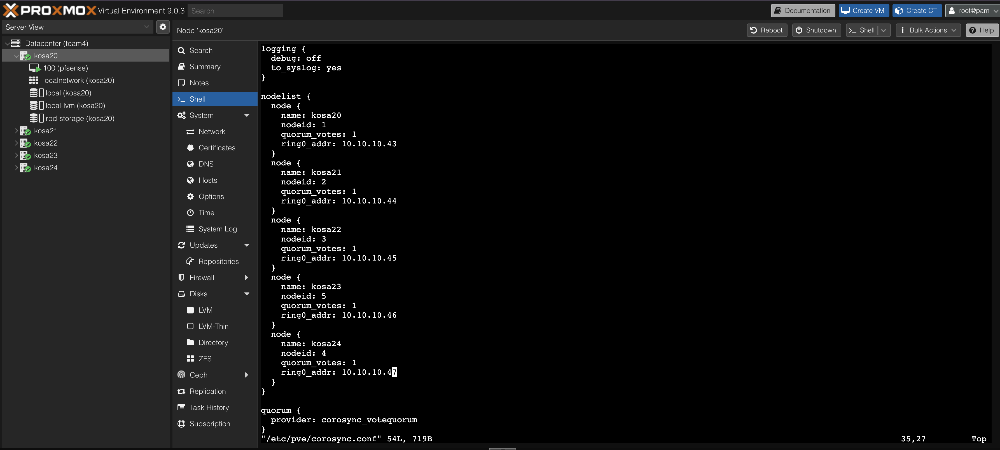
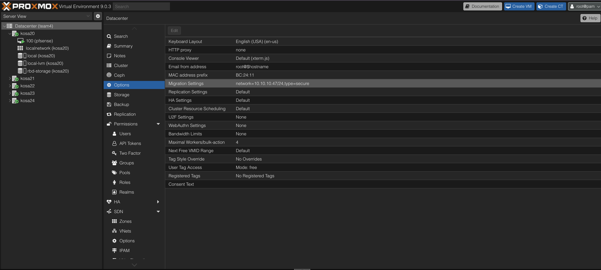
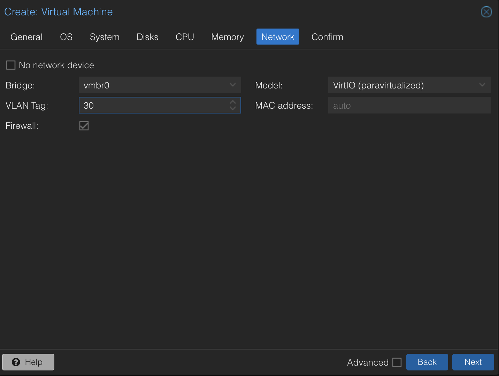
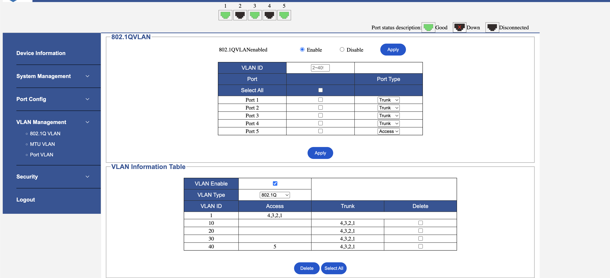
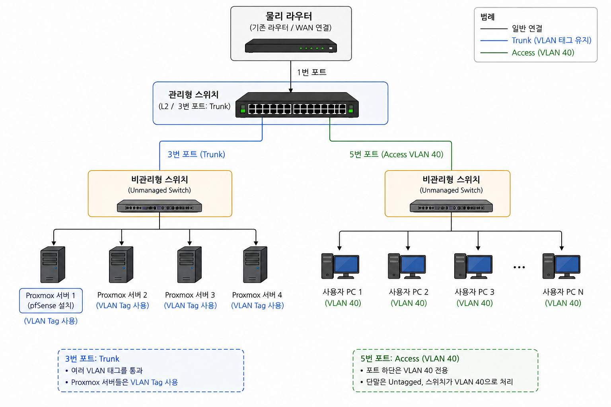
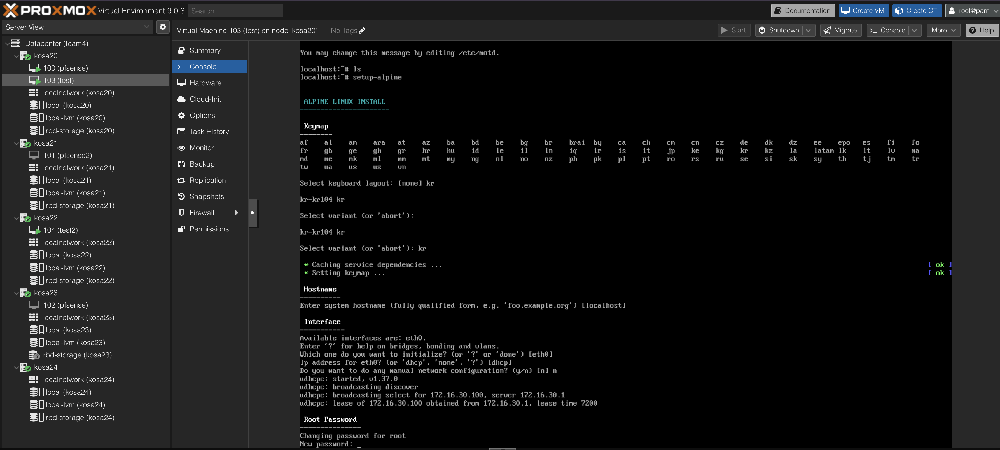
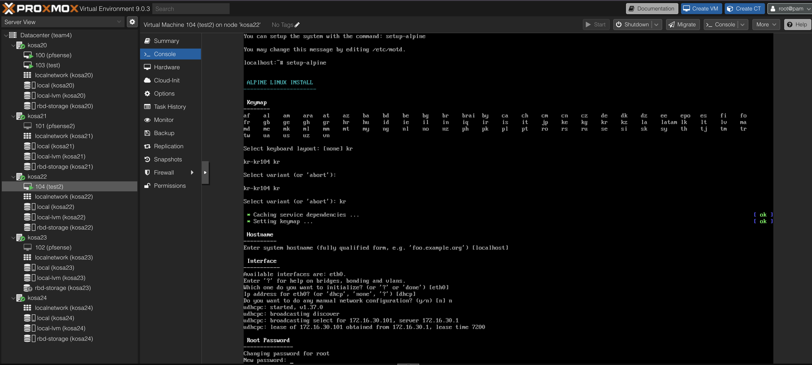
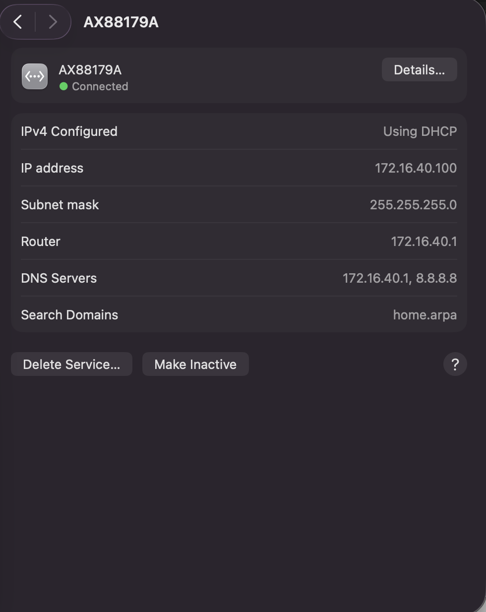

# 01. 네트워크 및 인프라 구성

## Proxmox 노드 IP 설정

- Pfsense 하위 VLAN 대역 IP로 설정할 경우
  - Pfsense가 망가지면 Proxmox 웹 콘솔 접근 불가(VLAN 대역 라우팅 불가능)
  - 클러스터 통신 자체는 10G 망으로 설정해두었기 때문에 Pfsense와 무관함
  - Proxmox 관리 콘솔 안정성을 위해 Pfsense 이중화를 구성하는 것은 오버엔지니어링이라 판단해 스킵함
    - Pfsense VLAN 대역 라우팅의 경우 Proxmox HA를 통해 안정성 확보
      - Pfsense Proxmox HA가 동작하는 동안의 일시적인 장애는 우선 보류
- 물리 라우터 하위 IP 대역으로 설정
  - Pfsense와 무관하게 웹 콘솔 접근 가능
    | 장비 | 역할 | IP |
    | ------- | ------------------ | ------------ |
    | kosa20 | Proxmox Node | 192.168.34.2 |
    | kosa21 | Proxmox Node | 192.168.34.3 |
    | kosa22 | Proxmox Node | 192.168.34.4 |
    | kosa23 | Proxmox Node | 192.168.34.5 |
    | kosa24 | Proxmox Node | 192.168.34.6 |
    | pfSense | Gateway / Firewall | 192.168.34.7 |

## Proxmox 클러스터 10G 설정

- Proxmox Cluster 생성 명령어 link 옵션에 10G 네트워크 명시
  - `/etc/pve/corosync.conf` 나머지 노드 addr 10G 설정



---

## Proxmox 클러스터 Migration 10G 설정

- Proxmox Cluster 옵션
  - Migration Settings 네트워크 10G 설정



---

## VLAN 설명

### 용어 설명

- VLAN
  - 하나의 물리 네트워크를 여러 개의 논리적인 L2 네트워크로 분리하는 기술
  - Ethernet Frame에 802.1Q VLAN Tag(VLAN ID)를 추가하여 논리적인 네트워크를 구분함
  - VLAN이 다르면 서로 다른 Broadcast Domain처럼 동작함
  - VLAN 간 통신(L3 Routing)을 위해 라우터 또는 L3 장비에 VLAN별 게이트웨이 인터페이스를 설정함
  - ex) VLAN 10 → 192.168.10.1

## 

`[출처]: https://notsosecure.com/exploiting-vlan-double-tagging`

- Tagged, Untagged
  - VLAN 태그가 프레임에 존재하는 상태 = `Tagged`
  - VLAN 태그가 없는 상태 = `Untagged`

- Access 포트
  - 특정 VLAN 전용 포트로 동작
    - 일반 단말(PC 등) 연결용으로 사용
    - Access 포트로 들어온 Untagged 프레임은 설정된 VLAN 소속으로 처리됨
      - Trunk 포트에서 전달된 Tagged Frame은 Access 포트 하위 장비로 송신될 때 VLAN Tag가 제거되어 전달된다고 해석하면 됨
    - 다른 Trunk 포트로 전달될 때 스위치가 VLAN Tag를 추가하여 송신함
- Trunk 포트
  - 여러 VLAN의 Tagged Frame을 전달하기 위한 포트
  - VLAN Tag를 유지한 상태로 프레임을 전달하겠다는 선언
  - 스위치 간 연결, Hypervisor, pfSense 연결 등에 사용
  - 허용되지 않은 VLAN Tag 수신 시 스위치 정책에 따라 Drop될 수 있음
  - ex) VLAN 40 TRUNK 설정 함 -> VLAN 40 태그가 붙은 프레임을 연결된 장비로 전달하겠다.

### VLAN 태그 붙이는 방법

1. OS 네트워크 단에 VLAN 설정 -> PC에서 프레임 나갈 때 설정한 VLAN 태그를 붙여서 송신함

```
auto eno1
iface eno1 inet manual

auto vmbr0
iface vmbr0 inet manual
    bridge-ports eno1
    bridge-stp off
    bridge-fd 0

auto vmbr0.10
iface vmbr0.10 inet static
    address 192.168.10.100/24
    gateway 192.168.10.1
```

2. Proxmox VM 설정에 VLAN 설정 -> VM에서 프레임 나갈 때 설정한 VLAN 태그를 붙여서 송신함
   
3. Access 포트 설정 -> Access 포트 하위 장비에서 프레임을 송신하는 경우 다른 포트로 보낼 때 VLAN 태그를 붙여서 송신함
   

### VLAN 라우팅

- VLAN은 L2 단에서 네트워크를 논리적으로 분리함
- 서로 다른 VLAN 간 통신을 위해서는 L3 라우팅이 필요함
- 라우터 또는 L3 장비는 802.1Q VLAN Tag를 인식하여 VLAN별 인터페이스(게이트웨이)를 구성함
- 각 VLAN 인터페이스에는 VLAN별 게이트웨이 IP를 할당함
  - ex)
    - VLAN 10 → 172.16.10.1
    - VLAN 20 → 172.16.20.1
- 필요 시 VLAN별 DHCP, 방화벽 정책, NAT 등을 설정할 수 있음
- 기존에는 물리 라우터 관리 페이지에서 VLAN 관련 설정
- 기존 물리 라우터의 VLAN/L3 역할을 pfSense가 담당 -> 라우터 VLAN 설정 제거
  - VLAN 10 DHCP 요청 송신
    - 스위치는 VLAN 10 Tag를 유지한 상태로 Trunk를 통해 pfSense로 전달
    - pfSense는 VLAN 10 인터페이스를 통해 요청을 수신 - VLAN 10 대역에 맞는 DHCP IP를 할당 - ex) 172.16.10.x
  - VLAN 태그가 설정되지 않은 경우
    - 단말은 Untagged Frame으로 DHCP 요청 송신
    - 스위치는 Untagged Frame을 Native VLAN(기본 VLAN)으로 처리
    - 일반적으로 VLAN 1
    - pfSense에 해당 Native VLAN 인터페이스가 없거나 DHCP가 설정되지 않은 경우 DHCP 요청 처리 실패
      결과적으로 IP를 할당받지 못하거나, 네트워크 구조에 따라 상위 물리 라우터 DHCP를 받을 수 있음

---

## 네트워크 구성



---

## VM VLAN 구성 및 DHCP

- 172.16.30.100 (KOSA20 Node VM)



- 172.16.30.101 (KOSA22 Node VM)



---

## PC VLAN 구성 및 DHCP

- Access Port VLAN 40 하단에 사용자 PC 연결
- 172.16.40.100 (노트북)
  
